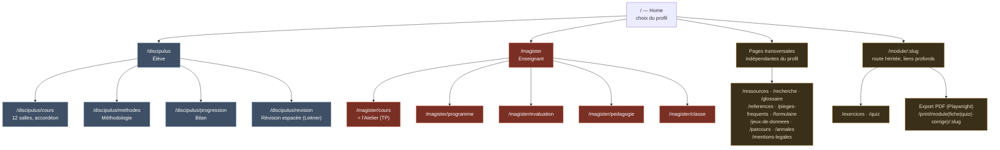
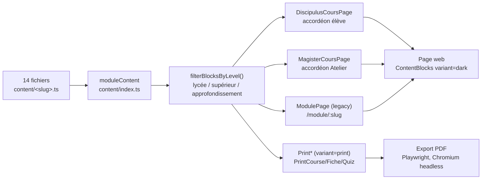

# Geo-In-Spectra

Site pédagogique de géomatique et télédétection, pensé comme une galerie : chaque
salle (module) est illustrée par une œuvre réelle du domaine public (Vermeer,
Cellarius, Raphaël, Ortelius, Francken) choisie pour son lien avec le sujet
enseigné, pas pour décorer. Le fond de chaque salle est l'œuvre elle-même en plein
cadre ; les planches diagrammatiques (SVG gravées à la main) illustrent les concepts
sans jamais casser l'identité visuelle. Chaque salle propose aussi un quiz noté, un
cours et une fiche mémo téléchargeables en PDF.

## Stack

- React 19 + TypeScript + Vite 7
- React Router 7 (HashRouter, compatible hébergement statique sans config serveur)
- Tailwind CSS (palette et polices propres au site, voir plus bas)
- GSAP + ScrollTrigger + Lenis (smooth scroll, révélation des salles au scroll)
- Playwright (devDependency, sert uniquement à l'export PDF, voir plus bas)

## Identité visuelle

- **Palette** : `ink` / `canvas` (fonds sombres), `parchment` (texte), `gilt` /
  `gilt-bright` (or, accent principal), `lapis`, `oxblood` (accents secondaires,
  aussi utilisés pour les repères de niveau — voir « Niveaux » ci-dessous).
  Définie dans `tailwind.config.js`.
- **Typographie** : Cinzel (titres, façon plaque gravée), EB Garamond (texte
  courant), IBM Plex Mono (cartels, données, libellés).
- **Élément signature** : `GalleryFrame` (double filet doré + cartel façon musée) et
  `ArtworkBackdrop` (l'œuvre en fond plein cadre, avec dégradé et cartel en coin,
  utilisé sur l'accueil et en tête de chaque module).

## Commandes

```bash
npm install
npm run dev                 # serveur de dev
npm run build                # build production (dist/)
npm run test                  # vitest
npm run lint                   # eslint
npm run pdf:generate             # exporte les PDF de cours, voir "Export PDF"
npm run pdf:generate:fiches       # exporte les fiches mémo PDF
```

## Structure

```
src/
  components/
    content/
      ContentBlocks.tsx    # rend un tableau de ContentBlock (voir content/types.ts)
      RoomIndex.tsx          # "Plan de la salle" : table cliquable, scroll fluide vers la partie
    diagrams/
      registry.ts             # nom -> composant SVG + numéro de planche
      *.tsx                     # une planche gravée par concept
    gallery/
      ArtworkBackdrop.tsx     # œuvre en fond plein cadre (accueil, en-tête de module)
      GalleryFrame.tsx          # œuvre encadrée + cartel (page de garde des PDF)
    layout/                     # header, footer, grain de toile
  content/
    *.ts                          # cours complet de chaque salle, un fichier par module
    fiches/*.ts                     # version condensée (fiche mémo) de chaque salle
    types.ts                         # ContentBlock (paragraph, formula, callout, table, diagram…)
                                       # heading accepte un `level` (voir "Niveaux")
  data/
    modules.ts                     # 14 salles : slug, titre, résumé, thèmes, épigraphe
    artworks.ts                     # œuvre associée à chaque salle (+ crédits)
    glossary.ts                      # termes techniques, source universitaire, renvoi vers la salle
    references.ts                     # bibliographie groupée par thème (page /references)
    quizzes/*.ts                       # questions à choix multiple par salle
  pages/
    Home.tsx                         # frontispice + salles en fond plein cadre
    ModulePage.tsx                     # page web d'une salle (cours, PDF, fiche PDF, quiz)
    QuizPage.tsx                        # /module/:slug/quiz
    EpsgGamePage.tsx                     # /jeu/epsg
    PrintCourse.tsx                       # mise en page dédiée à l'export PDF du cours (thème papier clair)
    PrintFiche.tsx                         # idem pour la fiche mémo
    GlossaryPage.tsx                        # /glossaire (recherche incluse)
    ReferencesPage.tsx                       # /references
    LegalPage.tsx                              # /mentions-legales
  RootRouter.tsx                              # routes + masque header/footer/grain sur /print/*
scripts/
  lib/pdfServer.mjs                            # build + serve + kill, partagé par les deux scripts PDF
  generate-course-pdfs.mjs                      # voir "Export PDF"
  generate-fiche-pdfs.mjs                        # idem, pour les fiches mémo
public/
  pdf/<slug>/<NN>-<slug>-<type>.pdf                # PDF générés (regroupés par salle)
  images/gallery/                                   # les 8 œuvres (domaine public, Wikimedia Commons)
```

## Plan du site

Deux diagrammes tenus à jour avec `RootRouter.tsx` : l'arborescence des routes,
puis le circuit du contenu partagé par les trois profils de rendu (voir
"Structure" ci-dessus pour le détail des fichiers). Rendus nativement par
GitHub (Mermaid) ; une version illustrée reprenant la palette et les
polices du site est conservée dans [`docs/plan-galerie.html`](docs/plan-galerie.html)
(à ouvrir en local — GitHub n'exécute pas le CSS/JS d'un fichier HTML brut).

### Arborescence des routes



### Circuit du contenu

Les 14 salles ne sont écrites qu'une fois : un même tableau de `ContentBlock`,
filtré par niveau, alimente trois rendus web distincts et une mise en page
dédiée à l'export PDF — jamais une capture de la page web.



## Ajouter une salle (module)

1. Ajouter une entrée dans `src/data/modules.ts` (slug, titre, navLabel, résumé, thèmes, épigraphe).
2. Ajouter l'œuvre associée dans `src/data/artworks.ts` (même clé que le slug).
3. Créer `src/content/<slug>.ts` (cours complet) et `src/content/fiches/<slug>.ts` (fiche condensée), référencer les deux dans leurs `index.ts` respectifs.
4. Optionnel : `src/data/quizzes/<slug>.ts` (référencé dans `quizzes/index.ts`) — sans lui, le bouton « Faire le quiz » n'apparaît simplement pas sur la page.
5. `npm run pdf:generate -- <slug>` et `npm run pdf:generate:fiches -- <slug>` pour générer ses PDF.

Nav, page web et export PDF se branchent automatiquement sur ces données.

## Niveaux

Un bloc `heading` peut porter un `level` (`college-lycee`, `superieur`,
`approfondissement`), affiché comme un repère coloré au-dessus du titre
(`ContentBlocks.tsx`). Objectif : une même salle peut mélanger une explication
accessible dès le collège/lycée et un approfondissement de niveau supérieur, sans
dupliquer le contenu en plusieurs pages — le lecteur choisit jusqu'où descendre. Voir
`src/content/traitements-ia.ts` pour un exemple complet (10 sections, 3 niveaux).

## Diagrammes

Chaque planche est un composant SVG dans `src/components/diagrams/`, enregistré
dans `registry.ts`. Pour en ajouter une : créer le composant, l'ajouter au registre,
puis l'insérer où pertinent dans un fichier `src/content/<slug>.ts` via un bloc
`{ type: "diagram", name: "<clé-du-registre>", caption: "…" }`. Les planches ne sont
pas des fichiers image : elles sont dessinées au chargement, rien à stocker dans un dossier.

## Export PDF

Trois scripts, même pipeline partagé (`scripts/lib/pdfServer.mjs`) : build le site,
sert `dist/` en local, imprime via Chromium headless (Playwright) — jamais une
capture de la page web : `PrintCourse.tsx`/`PrintFiche.tsx`/`PrintQuiz.tsx` sont des
mises en page dédiées (`/print/module/:slug`, `/print/fiche/:slug`,
`/print/quiz/:slug`, `/print/quiz-corrige/:slug`), sans aucun élément d'interface web
(`RootRouter.tsx` masque header/footer/grain sur ces routes), **et sur un thème
papier clair délibérément différent du site** (fond sombre) : un support de cours
destiné à être imprimé ou lu comme un document, pas comme une page web.
`ContentBlocks`/`GalleryFrame`/`EngravedFrame` acceptent un prop `variant` (`"dark"`
pour le site, `"print"` pour ces pages) qui bascule leurs couleurs en conséquence —
aucun `displayHeaderFooter` Playwright : pas de bandeau ni de numérotation de page
superposés, la page de garde (illustrée) et le sommaire portent déjà leur propre
identité.

```bash
npm run pdf:generate                          # les 14 cours
npm run pdf:generate -- fondamentaux           # un seul cours
npm run pdf:generate:fiches                     # les 14 fiches mémo
npm run pdf:generate:fiches -- fondamentaux      # une seule fiche
npm run pdf:generate:quiz                        # les 14 quiz (énoncé + corrigé)
npm run pdf:generate:quiz -- fondamentaux         # un seul quiz
```

**Nommage** : `<NN>-<slug>-<type>.pdf` (ex. `01-fondamentaux-cours.pdf`,
`01-fondamentaux-fiche-memo.pdf`, `01-fondamentaux-quiz.pdf`,
`01-fondamentaux-quiz-corrige.pdf`) — le numéro d'ordre et le type de document
permettent de s'y retrouver une fois plusieurs PDF téléchargés dans le même dossier
de téléchargements. `<type>` vaut `cours`, `fiche-memo`, `quiz` (énoncé seul) ou
`quiz-corrige` (bonne réponse + explication). Le bouton de téléchargement du corrigé
n'apparaît que côté Magister (`showTeacherMeta`, voir `ModuleChapterBody.tsx`) — pas
sur la page Cours de Discipulus, pour ne pas exposer les réponses à l'élève avant le
quiz interactif.

## Feuille de route

18 salles en ligne aujourd'hui. Les six premières (plus L'Atelier, en clôture) sont le
socle d'origine ; les onze suivantes couvrent des thèmes spécialisés ajoutés ensuite,
étoffées depuis à un niveau de détail comparable — dont quatre salles-outils (QGIS,
TerrSet, R, VS Code), chacune un tutoriel logiciel complet plutôt qu'une simple mention
en passant dans Le Compas :

1. **Fondements** (`fondamentaux`) — coordonnées/EPSG, projections, vecteur/raster,
   histoire de la cartographie, lecture de carte, débat Mercator/Peters, codes
   géographiques (INSEE/COG, NUTS, cadastre)
2. **Le Regard** (`teledetection`) — rayonnement électromagnétique, capteurs
   optique/radar, résolutions, missions Sentinel/Landsat
3. **Les Couleurs** (`indices-spectraux`) — NDVI/NDMI/NDBI et indices dérivés,
   indices composés (Tasseled Cap), validation statistique, séries temporelles
4. **Le Compas** (`outils-sig`) — QGIS, analyses spatiales (Moran, MAUP),
   géostatistique (krigeage), PostGIS/PyQGIS
5. **QGIS** (`qgis`) — tutoriel complet du SIG open-source : interface, boîte à
   outils de traitement, modeleur graphique, PyQGIS, extensions et automatisation
6. **TerrSet** (`terrset`) — tutoriel complet du logiciel Clark Labs (ex-IDRISI) :
   classification raster, évaluation multicritère, chaînes de Markov, automates
   cellulaires et Land Change Modeler
7. **R** (`programmation-r`) — tutoriel complet du langage : tidyverse, `sf`/`terra`,
   statistique et géostatistique spatiales, reproductibilité (R Markdown/renv)
8. **VS Code** (`vscode`) — tutoriel complet de l'éditeur : extensions Python/Jupyter,
   débogueur, Git intégré, environnements distants et automatisation (tasks.json)
9. **L'Intelligence** (`traitements-ia`) — filtres à noyau, classification,
   matrice de confusion/kappa, deep learning (CNN, U-Net, Transformers)
10. **La Méthode** (`methodologie`) — commentaire de document, dissertation,
    rapport technique SIG, sémiologie de Bertin, préparation aux concours,
    mémoire IMRaD
11. **Les Projections** (`projections-avancees`) — familles de déformation,
    Lambert-93/UTM, datum et transformation, choix d'une projection
12. **Le Web** (`cartographie-web`) — pyramide de tuiles, Leaflet/MapLibre,
    standards OGC (WMS/WMTS/WFS), performance et accessibilité
13. **Les Statistiques** (`statistiques-spatiales`) — LISA, Gi* de Getis-Ord,
    estimation de densité par noyau, régression spatiale, cartographie du risque
14. **Le Drone** (`photogrammetrie-drones`) — Structure from Motion, MNS/MNT,
    points d'appui au sol, planification de vol, RTK/PPK
15. **Le LiDAR** (`lidar`) — temps de vol laser, retours multiples, classification
    du nuage de points, plateformes aéroportées/terrestres
16. **La Base** (`bases-donnees-spatiales`) — index spatial GiST, requêtes et
    jointures spatiales, topologie, performance (EXPLAIN ANALYZE)
17. **Les Secteurs** (`etudes-de-cas-sectorielles`) — agriculture de précision,
    artificialisation des sols, risque incendie, foresterie
18. **L'Atelier** (`travaux-pratiques`), en clôture — douze séances pratiques
    autonomes (un semestre universitaire), réparties sur les trois profils
    lycée/licence-BUT/master-recherche via le système de niveaux, qui réutilisent
    les compétences des salles précédentes (géoréférencement par grille,
    NDVI/statistiques zonales/ΔNDVI, buffer/intersection, programmation Python,
    étude de cas)

Glossaire (avec sources et recherche), page Références (bibliographie par thème),
quiz interactif et fiches mémo PDF couvrent les 18 salles.

## Déploiement

Vercel — `vercel.json` à la racine, build Vite standard, pas de config serveur
nécessaire (HashRouter évite les 404 au refresh sur les routes de module).
